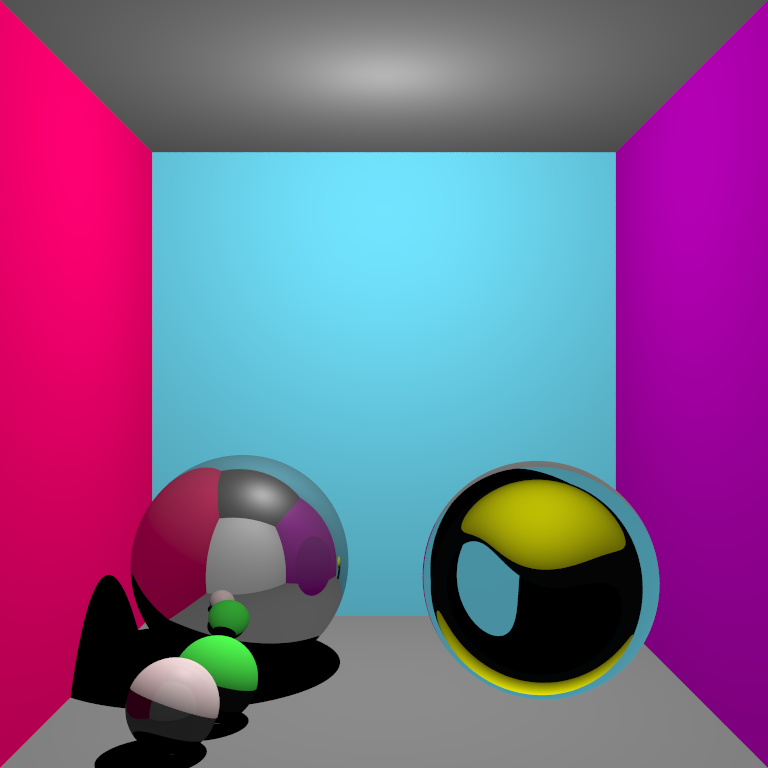
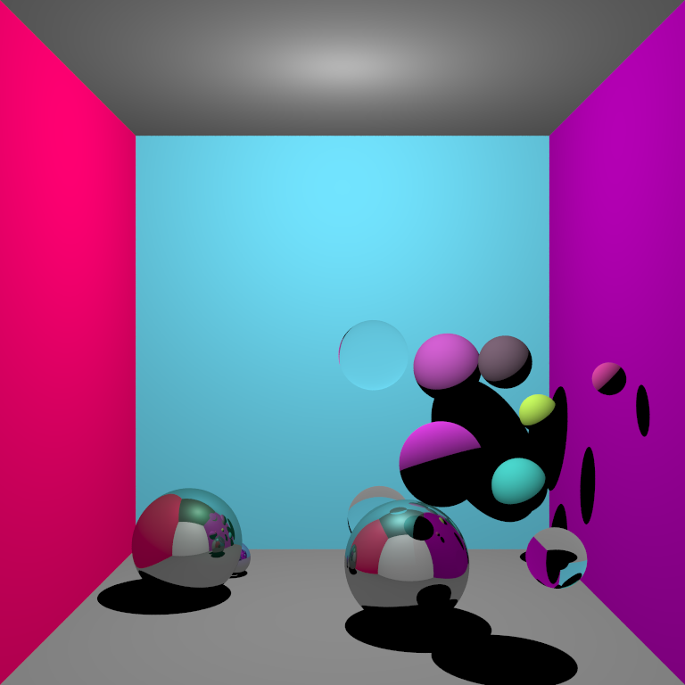
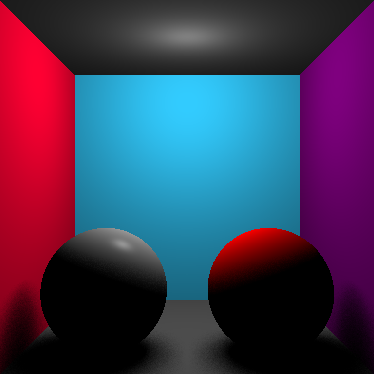
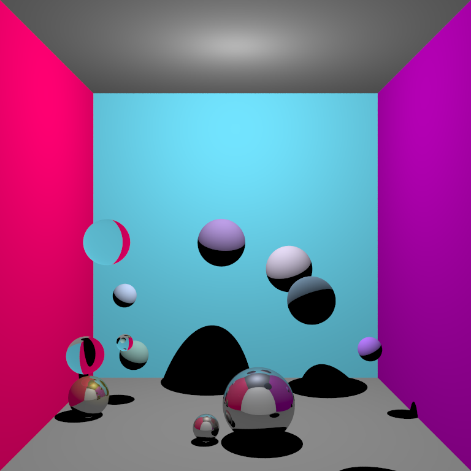
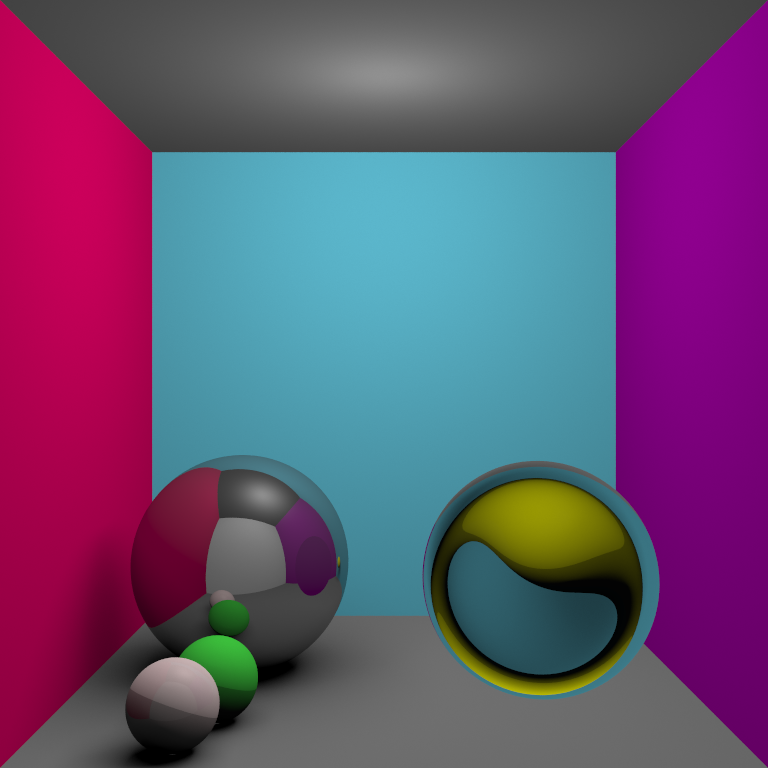

# Implementation Basique RayTracing 
Dans le cadre du Master Informatique parcours IMAGINE, réalisation d'un raytracer simple sur CPU. Exemple de rendu de scène (3) : 



*Hard Shadow (One-ray cast) with gamma 2 correction
Composition: a yellow ball is hidden behind glass material, rose sphere is specular (+ diffuse & ambient), green is mainly diffuse (+ambient), ball in the left back is entirely specular.*


Implémentation: 
- [X] Phong lighting model 
- [X] Triangle Intersection
- [X] 'Hard' Shadow
- [X] Soft Shadows (Light source oversampling)
- [X] Anti-aliasing
- [X] Mirror Material handled 
- [X] Transparency Material handled 
- [ ] Parallélisation avec OMP 
- [ ] Multiple light sources 
- [X] Color correction : Gamma2

---
### Build

``` 
mkdir build
cd build
cmake ..
``` 
Linux 
``` 
make -j
./raytracer 
```
 Windows : use Visual Studio 2019 
 NB: les informations de sortie sont affichées dans la fenetre d'execution de MVSC.
 
2 builds sous Windows x64 sont disponibles sous `bin/Release-hardshadow/raytracer.exe` (anti-aliasing et hard-shadow) et `bin/Release/raytracer.exe` (anti-aliasing et soft-shadow).
 
---
### Run 

Le rendu temps-réel de la fenêtre implémente le modèle de Phong (ambient, diffuse, specular). Pour rendre avec le lancer de rayon récursif, appuyer sur `R`. 

Les différentes scènes sont accessibles via les touches `1`, `2`, `3`, `4` :
- 1 : Test Intersection sphere Diffuse 
- 2 : Test Intersection Square
- **3** : Scène fermée avec plusieurs matériaux : diffuse, ambient, specular, transparency
- **4** : Scène créée de manière aléatoire avec plusieurs matériaux de différentes couleurs. 

L'image utilisant le raytracing sera enregistrée dans le dossier courant sous *output.png*. 

---
### Exemples

Exemple de rendu Scène 4 pseudo-aléatoire : anti-aliasing (64 échantillons par pixel), hard-shadow  




Exemple de rendu : pas d'anti-aliasing (1 échantillon par pixel), soft-shadow (128 échantillons)




Exemple de rendu Scène 4 pseudo-aléatoire : anti-aliasing (64 échantillons par pixel), hard-shadow 



Exemple de rendu Scène 4 pseudo-aléatoire : anti-aliasing (64 échantillons par pixel), soft-shadow (256 échantillons)


